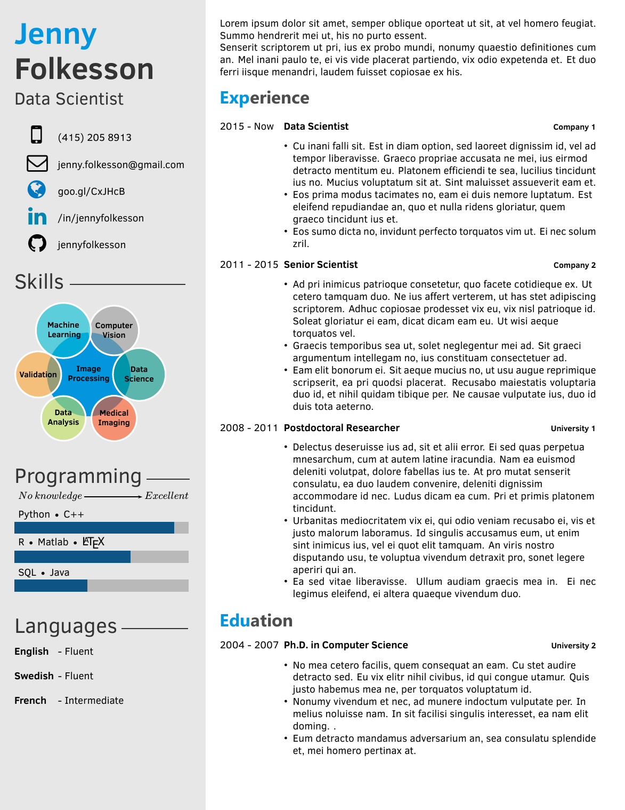

# LaTeX resume template

This is forked from Harsh Gadil's [resume template](https://github.com/opensorceror/Data-Engineer-Resume-LaTeX)

He in turn compiled it with elements from several other templates, including:

1. [Carmine Spagnuolo's Twenty Seconds Curriculum Vitae](https://github.com/spagnuolocarmine/TwentySecondsCurriculumVitae-LaTex)
2. [Carmine Benedetto's Smart Fancy LaTeX CV](https://github.com/neoben/smart-fancy-latex-cv)
3. [Adrien Friggeri's Fancy CV](https://www.sharelatex.com/templates/52fb8c1f33621a613683ecad)

 **Important**: Make sure to compile with XeLaTeX, not PDFLaTeX.

